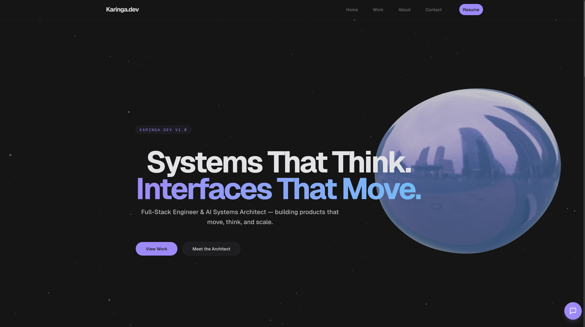

# Karinga.dev

> Personal portfolio for **Nagesh Goud Karinga** — Full-Stack Engineer & AI Systems Architect.
> Built at the intersection of performance engineering, creative technology, and real-time AI.



Live site: [karinga.dev](https://karinga.dev)

---

## Tech Stack

| Layer | Technology |
|---|---|
| Framework | Next.js 16 (App Router, Turbopack) |
| Language | TypeScript 6 |
| Styling | Tailwind CSS v4 (CSS custom properties, no arbitrary values) |
| 3D | Three.js + React Three Fiber + Drei |
| Animation | GSAP 3 + ScrollTrigger · Framer Motion 12 · Lenis smooth scroll |
| AI | Vercel AI SDK v6 (`ai`) + `@ai-sdk/anthropic` (Claude) |
| Rate Limiting | Upstash Redis (`@upstash/ratelimit`) |
| State | Zustand 5 |
| Validation | Zod 4 |
| Deployment | Vercel |

---

## Features

- **3D animated background** — WebGL mesh rendered via React Three Fiber, globally composited behind all content
- **AI chat widget** — Real-time streaming chat powered by Anthropic Claude via Vercel AI SDK v6; scroll-locked when open
- **Smooth scroll** — Lenis virtual scroll engine synchronized with GSAP ScrollTrigger for frame-accurate animation triggers
- **Scroll-driven animations** — GSAP ScrollTrigger for section entrances; Framer Motion `whileInView` for component-level reveals
- **Project portfolio** — Dynamic `/work/[slug]` routes with `next/image`, OG metadata, and full project detail pages
- **SEO-ready** — `robots.ts`, `sitemap.ts` (static + dynamic project routes), Open Graph + Twitter Card metadata, canonical URLs
- **Accessible** — `aria-label`, `focus-visible:ring`, `motion-safe:` guards, `useReducedMotion` hook throughout
- **Mobile-first** — Responsive across all breakpoints with hamburger nav and touch-optimized scroll multipliers

---

## Project Structure

```
app/
  api/chat/route.ts       # AI chat streaming endpoint (Anthropic Claude)
  work/[slug]/page.tsx    # Dynamic project detail pages
  robots.ts               # Crawler rules
  sitemap.ts              # Auto-generated sitemap (static + dynamic routes)
  layout.tsx              # Root layout, metadata, global providers

components/
  canvas/Scene.tsx        # Three.js 3D background (global)
  layout/                 # Nav, Footer, SmoothScroll, PageTransition
  sections/               # Hero, About, Work, Contact
  ui/                     # Button, Tag, Reveal, BackToHome, chat/*

lib/
  projects.ts             # Project data + WORK_ANIMATION constants
  animations.ts           # SCROLL_CONFIG constants
  gsap/config.ts          # GSAP + ScrollTrigger singleton

store/
  useUIStore.ts           # Zustand store (chat open, scroll state)

hooks/
  useReducedMotion.ts     # Prefers-reduced-motion hook
```

---

## Getting Started

### Prerequisites

- Node.js 20+
- An [Anthropic API key](https://console.anthropic.com)

### Installation

```bash
git clone https://github.com/Nkaringa/karinga.dev.git
cd karinga.dev
npm install
```

### Environment Variables

Create a `.env.local` file in the root:

```env
ANTHROPIC_API_KEY=sk-ant-...
NEXT_PUBLIC_BASE_URL=http://localhost:3000
UPSTASH_REDIS_REST_URL=https://...
UPSTASH_REDIS_REST_TOKEN=...
```

> `.env.local` is gitignored — never commit your API key.

### Development

```bash
npm run dev
```

Opens at `http://localhost:3000` with Turbopack HMR.

### Production Build

```bash
npm run build
npm run start
```

---

## Deployment

Deployed on **Vercel**. Required environment variables in the Vercel dashboard:

| Variable | Description |
|---|---|
| `ANTHROPIC_API_KEY` | Anthropic API key for the AI chat widget |
| `NEXT_PUBLIC_BASE_URL` | Production URL (e.g. `https://karinga.dev`) |
| `UPSTASH_REDIS_REST_URL` | Upstash Redis URL for rate limiting |
| `UPSTASH_REDIS_REST_TOKEN` | Upstash Redis token for rate limiting |

---

## Architecture Notes

- **AI chat guardrails** — Rate limited to 10 requests/hour per IP via Upstash Redis. Topic-scoped system prompt refuses off-topic usage. 400 token cap per response, 500 character input limit, 10-message history cap.
- **AI SDK v6** — Uses `sendMessage({ text })`, `UIMessage` with `.parts`, `toUIMessageStreamResponse()`. See `components/ui/chat/` and `app/api/chat/route.ts`.
- **Lenis + GSAP sync** — `lenis.on("scroll", ScrollTrigger.update)` in `SmoothScroll.tsx` keeps virtual scroll and ScrollTrigger in frame-accurate sync.
- **CSS custom properties** — All colors are defined as CSS variables (`--color-bg`, `--color-accent`, etc.) and consumed via Tailwind's `var()` syntax. No arbitrary hex values.
- **No component exceeds 250 lines** — Single-responsibility pattern enforced throughout.

---

## Author

**Nagesh Goud Karinga**
Full-Stack Engineer & AI Systems Architect

[karinga.dev](https://karinga.dev) · [GitHub](https://github.com/Nkaringa)

---

## License

MIT — feel free to use this as inspiration. A credit or star is appreciated.
